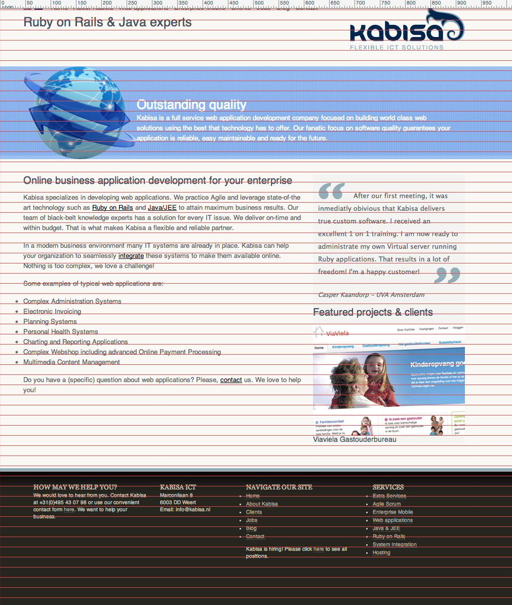
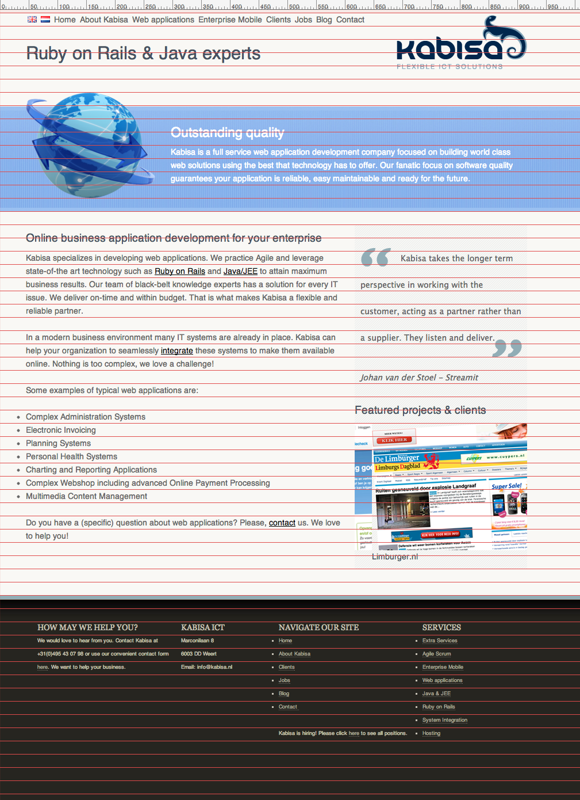

# Vertical Rhythm

See the [Kabisa site](http://kabisa.nl) (as of March 2013) but then with some [vertical
rhythm](http://24ways.org/2006/compose-to-a-vertical-rhythm/) added to it.

## Setup

    gem install
    middleman

Open your favorite browser and navigate to `http://localhost:4567`.

## Without vertical rhythm

## With vertical rhythm

